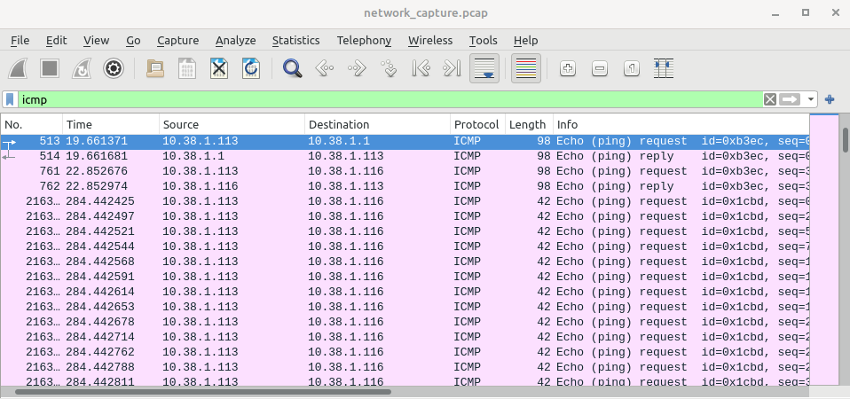

# Network-Traffic-Analysis

## Introduction
In the realm of network security, understanding how to monitor and analyze network traffic is a fundamental skill. This lab serves as a practical demonstration of tcpdump and Wireshark, two indispensable tools for network analysis. This lab is designed to showcase their capabilities through a controlled creative scenario. The following outlines capturing, saving, and analyzing network traffic, with an emphasis on how these tools apply to real-world cybersecurity challenges.  

The setup consists of a small, virtualized network consisting of two virtual machines (VMs): a Kali Linux VM for capturing and analyzing traffic, and a Ubuntu Linux VM. This setup allows to simulate diverse traffic scenarios and provides meaningful data for analysis.  

## Lab Objectives
The primary goals of this lab are: 

1. To introduce key tcpdump commands and demonstrate how to capture specific types of traffic.  

2. To generate and examine diverse network traffic, including simulated malicious activity.

3. To save captured traffic to a file for further inspection using Wireshark.   

## Lab Setup
The lab environment consists of two interconnected VMs:

> **Kali Linux VM:** Used for capturing traffic with tcpdump and analyzing it with Wireshark.   
> **Ubuntu Linux VM:** Used as the simulated target to practice on with ports 22 and 80 open. 

These machines are connected via a virtual network to ensure controlled and reproducible results. 

## What is tcpdump?
Tcpdump is a command-line tool used to capture and analyze network traffic. It acts metaphorically as a powerful magnifying glass, allowing us to filter and observe data packets as they are traversing through a network medium. Tcpdump is a highly customizable command and forms the backbone of many network analysis workflows, particularly in cybersecurity. It’s versatility and ability to save traffic for later analysis make it invaluable for professionals working to secure computer networks. 

## Capturing Traffic with tcpdump
With traffic flowing, it's time to capture it using tcpdump:

- **Basic Capture**:
  
  **tcpdump -i eth0**
  
Captures all traffic on the specified network interface. 

- **Filter Captiure**:
  
  **tcpdump -i eth0 port 80**
  
Captures HTTP traffic only, focusing on web interactions.

- **Advanced Filters**:
  
  **tcpdump -i eth0 src 10.38.1.113 and dst port 22**
  
Captures SSH traffic originating from the Kali VM to the Ubuntu VM.

## Generating Network Traffic
To produce traffic for analysis, traffic is realistically simulated and varied network interactions:

1. **Ping Sweeps and Network Scans:**
   > Conduct a ping sweep or a network scan from Kali using tools like fping to identify active hosts. These first three commands will generate a very large ARP storm.

2. **File Transfers via SSH:**
   > Establish an SSH session from Kali to Ubuntu and use scp to transfer files. This simulates secure file transfer.

SSH connection from Kali VM to Ubuntu VM successful. Before proceeding further, I'll create a test file on the Kali VM and then transfer it to the Ubuntu VM. 

File transfer verification on Ubuntu VM. 

3. **Simulated Malicious Activity:**
   > Use tools like hping3 on Kali to create malformed or suspicious packets, mimicking attack patterns.

**hping flood on port 80**

**hping icmp flood**

**hping fragmented packets**

**hping data injection**

**hping spoofed IP source**

   
## Saving Captures for Analysis
To preserve captured traffic for analysis with Wireshark, use the -w option:
tcpdump -i eth0 -w network_capture.pcap
This saves the traffic to a PCAP file, which can be loaded into Wireshark for detailed inspection.

## Analyzing Traffic with Wireshark
Wireshark allows for in-depth examination of network data:

1. **Load the Capture:** Open the network_capture.pcap file in Wireshark

2. **Apply Filters:** Use Wireshark's powerful filtering capabilities to isolate specific types of traffic, such as HTTP, ICMP, or SSH.
   
3. **Identify Patterns and Anomalies**:
   - Examine HTTP requests and responses to analyze web activity.
   - Investigate SSH traffic for unauthorized access attempts.
   - Detect unusual packet structures indicative of malicious behavior.

Let's further examine the network_capture.pcap file. 

The commands ran in this lab produce various traffic types on computer networks. In this lab, I've captured the various traffic types to simulate reconnaissance, attacks, and legitimate activity. In this section, the most interesting findings will be analyzed. 

### Reconnaissance Traffic

- **ARP-Scan Traffic**

Address Resolution Protocol - ARP is essential for mapping IP addresses to MAC addresses on a local network. However, attackers or administrators can exploit ARP to discover devices by sending a series or ARP requests to various IP addresses. This traffic demonstrates an ARP sweep, which systematically queries a range of IP addresses to identify active hosts on a local network. 

This ARP storm demonstrates how attackers or network administrators might query an entire subnet to discover active hosts. The systematic ARP request (who has <IP>?) and the corresponding replies (<IP> is at <MAC>) reveal live devices and their MAC addresses. This behavior is typical of reconnaissance activity and highlights the importance of monitoring ARP traffic to detect and mitigate unauthorized network mapping attempts. 

- **Ping Sweep Traffic**

This ping sweep traffic demonstrates how attackes can use ICMP traffic to discover live hosts on a network. The systematic nature of Echo Requests (targeting multiple IPs) and the rapid sequence of packets indicate automated reconnaissance. The responses from specific hosts reveal which devices are active and reachable, providing valuable information for further attacks. This activity underscores the importance of monitoring ICMP traffic and implementing network defenses and block reconnaissance attempts. 

- **Nmap Scan Traffic**

This capture highlights an Nmap SYN scan, where the scanner sequentually probes multiple ports on the target system. Closed ports respond with RST, ACK packets, while open ports (e.g., SSH port port 22) sends SYN, ACK packets. This reconnaissance activity demonstrates the early stages of an attack, providing critical information about a targets network and services.

Port 22 SYN, ACK - Port 22 Open 

Port 80 SYN, ACK - Port 80 Open

- **SSH Traffic**

If we right click on the first SSH packet and select Follow > TCP Stream, we have the TCP Threeway Handshake for the SSH connection. 

SSH Traffic Details

Here we the client/server communication for the key exchange. Packets we can sift through and gather meta data from. 

Encrypted Traffic Related to SCP File Transfer. 

Here we have the consistent traffic pattern of Encrypted Packet Client/Server communication over the SSHv2 protocol. The sequence and frequency of packets align with the behavior of a file transfer, where data is segmented into chucks and set over the SSH connection. The varying packet lengths (len=44, len=628, etc.) indicate data transfer activity. Larger packets suggest chucks of the file being sent, while smaller packets include control messages and acknowledgements. 

In addition to that the packets of this traffic have the TCP ACK and PSH flags set, which are commonly seen during active data transfer. 

- **TCP SYN Flood on Port 80**

These packets represent a TCP SYN Flood attack targeting port 80 on the destination IP. The rapid rate of SYN packets with no corresponding responses indicates a deliberate attempt to exhuast the target's resources by creating half-open TCP connections. This is a classic Denial of Service (DoS) tactic, designed to disrupt services by overwhelming the target's ability to handle legitimate traffic. 

- **Malformed (Fragmented) Packets**

This traffic highlights the deliberate fragmentation of packets, with the More Fragments (MF) flag set. Fragmented packets, each with a small size of 54 bytes, are sent in rapid succession to overwhelm the target. This technique can evade firewalls and IDS by making reassembly difficult, demonstrating how attackers might bypass detection or consume system resources. 

- **Custom Payload**

 Here we have the traffic from the command "hping -S -p 443 -d 100 --data "malicious payload" 10.38.1.116"

The [RST, ACK] flags indicate that the receiving system (destination) is rejecting the connection. This is expected if the system is not configured to handle the specific payload or if it identifies the packets as malformed or suspicious. The packet length (60) matches the size of the TCP headers plus any payload. Since the -d 100 option was used, the payload adds extra bytes to the total length. The high volume of packets sequential source ports suggests that this is artificially generated traffic, consistent with hping3's behavior. The receiving system is responding with TCP Reset (RST), which occurs when a system does not expect or cannot process a connection request. This is often a sign of suspicious or malformed traffic being rejected. 

- **Spoofed Traffic**

Here we can see the traffic from the command "hping3 -S -p 80 --spoof 192.168.1.100 10.38.1.116". 

All packets have a spoofed source IP address of 192.168.1.100. The actual system sending the traffic (Kali VM) is hiding its true IP by crafting packets with this fake source address. 

  

 ## Real World Application
 This lab demonstrates how tcpdump and Wireshark can be used in a professional setting to monitor, diagnose, and secure network environments. From identifying potential intrusions to analyzing legitimate traffic patterns, these tools provide cybersecurity professionals with critical visibility into network activity. 

